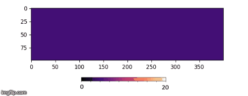
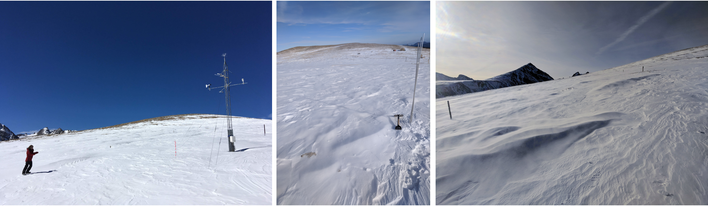
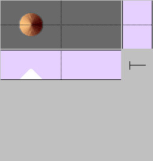
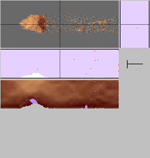
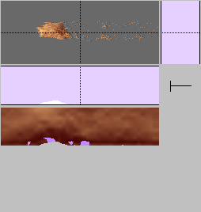
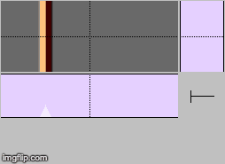
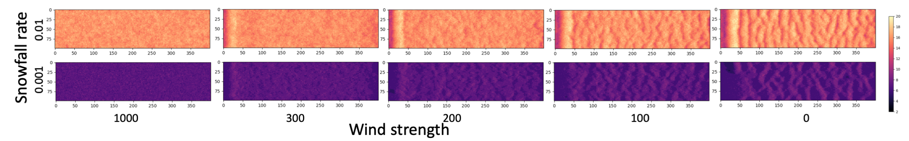

# Rescal-snow
A model of dunes and snow waves

[](https://joss.theoj.org/papers/822d9380fa5ce6f89cbbdebf1605df14)



1. [Motivation](#1-motivation)
2. [Getting started](#2-getting-started)
    1. [Prerequisites](#21-prerequisites)
    2. [Dependencies](#22-dependencies)
    3. [Download](#23-download)
    4. [Installation](#24-installation)
3. [Features](#3-features)
    1. [Example 1: a snow cone](#31-sand-and-snow-dunes)
    2. [Example 2: sintering snow](#32-sintering-snow)
    3. [Example 3: dune growth by snowfall](#33-dune-growth-by-snowfall)
    4. [Example 4: parameter space exploration](#34-parallel-instances-and-parameter-space-exploration)
4. [References and further reading](#4-references-and-further-reading)
5. [Community guidelines](#5-community-guidelines)
    1. [Citation](#51-citation)
    2. [Support](#52-support)
    3. [Contributing](#53-contributing)
6. [Contributors](#6-contributors)
7. [License](#7-license)

### 1. Motivation

When wind blows over snow, it self-organizes. This forms surface features, such as ripples and dunes, that alter the reflectivity and thermal conductivity of the snow.



Studying these features in the field is cold and challenging ([we've tried](https://doi.org/10.5194/tc-2019-45)), so
we created rescal-snow to enable snow scientists to study snow features in controlled numerical experiments.
We hope that this model will be useful to researchers in snow science, geomorphology, and polar climate.

Rescal-snow is able to simulate:

 - Snow/sand grain erosion and deposition by wind
 - Snowfall
 - Time-dependent cohesion (snow sintering)
 - Avalanches of loose grains

Rescal-snow is also designed for robust, reproducible science, and contains tools for high-performance computing, data management, and data analysis, including:

 - Workflow tools for generating and running many simulations in parallel
 - A python-based workflow that manages data and analysis at runtime


## 2. Getting started

### 2.1 Prerequisites

We assume you have reasonable familiarity with bash and terminal commands.
If you have never used bash, we recommend you stop and work through a short tutorial.
(Our favorite is ['The Unix Shell' from Software Carpentry](http://swcarpentry.github.io/shell-novice/).)
If you modify rescal-snow, you will need to modify and compile C code. We have also included some setup and analysis tools (used in Example 5) written in Python.

### 2.2 Dependencies

 * C compiler (GCC and CLANG are known to work)
 * [CMake] >= 3.9 (used for compiling)
 * make (used for compiling)
 * [libpng](http://www.libpng.org/pub/png/libpng.html) (known to work with v1.6.37)
 * Optional packages used for analysis (see the [analysis](analysis) and [scripts/utilities](scripts/utilities) directories):
   * Python3 (used for analysis)
   * numpy (used by Python3 for analysis)
   * pandas (used by Python3 for analysis)
   * scipy (used by Python3 for analysis)


On a Debian-based/Ubuntu Linux machine, the dependencies can be acquired using: 

```bash
sudo apt install gcc cmake make libpng-dev zlib1g-dev python3 python3-numpy python3-pandas python3-scipy
```

On most machines, the Python packages can also be acquired using:

```bash
pip3 install numpy pandas scipy
```

### 2.3 Download
Download rescal-snow by cloning this repository with git:

```bash
git clone https://github.com/kellykochanski/rescal-snow.git
cd rescal-snow
```

You may also download the repository manually from [Github](https://github.com/kellykochanski/rescal-snow).

### 2.4 Installation

In a terminal, navigate into the main rescal-snow directory (shown above). Run:
```bash
mkdir build
cd build
cmake -Wno-dev -DCMAKE_BUILD_TYPE=Release .. #Debug can be used instead of Release
make -j 4                                    #Adjust to the number of cores you have for a speedy build
```

## 3. Features

The examples below are fully described in the tutorial: [docs/rescal-snow-tutorial.md](docs/rescal-snow-tutorial.md).
The [docs](docs) folder also contains descriptions of additional configuration and analysis options; check these if you're looking for functionality not found in the tutorial.

### 3.1 Sand and snow dunes

The default configuration for Rescal-snow simulates snow (or sand) dune formation. This simulates processes including air flow; grain entrainment, saltation, suspension and deposition; and granular avalanches.

In these conditions, a pile of sand/snow (left) evolves into a dart-shaped barchan dune (middle), then dwindles as grains blow away without being resupplied (right).

|Initial condition, t = 0t0 	|  t = 30t0   | t = 90t0  |
|------------------------|--------------------|------------------|
|  |  |  |

Each of the three images above shows a shaded top-down view of a dune (top left), cross-sections through the dune, along the dashed lines (middle left, top right), and a cross-section showing the pressure intensity in the fluid (bottom left).

### 3.2 Sintering snow

Snow cohesion increases over time: this is called sintering.
Rescal-snow is able to simulate the transition of loose (beige) grains into sintered (light purple) grains within waves and dunes.



### 3.3 Dune growth by snowfall

Rescal-snow simulates snow by adding loose grains to the top of the simulation. The gif at the top of this page shows a height-map of a field of dunes and waves growing during snowfall.

### 3.4 Parallel instances and parameter space exploration
We believe that building robust, trustworthy models is much simpler when it's easy to make many model runs.

Rescal-snow contains a series of tools for running many simulation instances in parallel, and managing the associated flows of input and output data.

The following phase diagram shows images produced by ten parallel runs simulating different rates of snowfall (lambda\_I) and wind speed (Tau\_min). 




## 4. References and further reading

The [docs](docs) folder contains additional information on 
[performance and parallelization issues](docs/performance_and_parallelization.md), 
[model inputs and configuration](docs/rescal-snow-inputs.md),
[model calibration and validation](docs/calibration_and_validation.md),
and [development history](docs/NEWS.md)

For more background on snow dunes, sintering, and self-organization, see:
 - ['Snow bedforms: A review, new data, and a formation model', Filhol and Sturm, 2015](https://doi.org/10.1002/2015JF003529)
 - ['The evolution of snow bedforms in the Colorado Front Range', Kochanski, Anderson and Tucker, 2019](https://doi.org/10.5194/tc-13-1267-2019)
 - ['Statistical classification of self-organized snow surfaces', Kochanski, Anderson and Tucker, 2018](https://doi.org/10.1029/2018GL077616)
 - ['Studies on interaction between wind and dry snow surface', Kobayashi, 1980](https://eprints.lib.hokudai.ac.jp/dspace/bitstream/2115/20242/1/A29_p1-64.pdf)

For more information about the backend function of the cellular automaton and lattice gas model, see:
 - ['Setting the length and timescales of a cellular automaton dune model', Narteau et al., 2009](https://doi.org/10.1029/2008JF001127)
 - ['A real-space cellular automaton laboratory', Rozier and Narteau, 2014](dx.doi.org/10.1002/esp.3479)
 - ['Transport capacity and saturation mechanism in a real-space cellular automaton dune model', Gao et al., 2014](dx.doi.org/10.5194/adgeo-37-47-2014)
To learn the underlying principles of the lattice gas cellular automaton (LGCA)  model (recommended before modifying the LGCA, the boundary conditions, or the aspect ratio of the simulation) see:
 - ['Lattice-gas automata for the Navier-Stokes equation', Frisch, Hasslacher and Pomeau, 1986'](https://doi.org/10.1103/PhysRevLett.56.1505)

## 5. Community guidelines

We encourage you to interact with the project through Github (see below). This will allow easy integration of your changes and prevent rescal-snow from fragmenting excessively.
We use [this](https://nvie.com/posts/a-successful-git-branching-model/) git workflow,
with the expectation that new changes will be tested on the examples in the README, docs, or tutorials.
If you're not familiar with git, see [the software carpentry git tutorial](https://swcarpentry.github.io/git-novice/).

### 5.1 Citation

Do you want to incentivize developers to build and maintain the software you need? Cite us!
 - ['Rescal-snow: Simulating snow dunes with cellular automata', K Kochanski et al. (2019) Journal of Open Source Software, 4(42), 1699, https://doi.org/10.21105/joss.01699](https://joss.theoj.org/papers/10.21105/joss.01699#)

This software inherits many features from the Real-Space Cellular Automaton Laboratory, ReSCAL. Credit them by citing:
 - ['A real-space cellular automaton laboratory', O Rozier and C Narteau (2013), Earth Surface Processes and Landforms 39(1) 98-109, doi=10.1002/esp.3479](https://onlinelibrary.wiley.com/doi/abs/10.1002/esp.3479)


### 5.2 Support

If you have challenges or questions, look at the material under 'further information' or reach out to us.

Issues should be reported using Github's issue tracking function on this repository, [here](https://github.com/kellykochanski/rescal-snow/issues).

Issues which cannot be handled via Github can be addressed to

    Kelly Kochanski
    kelly.kochanski@gmail.com
    www.github.com/kellykochanski


### 5.3 Contributing

If you wish to contribute a new feature or report a bug, welcome!
See how to do this in [CONTRIBUTING.md](CONTRIBUTING.md).
Rescal-snow is distributed under the GNU GPL 3.0 license; all contributions must be made under this license or a later version.

## 6. Contributors
See [AUTHORS.md](AUTHORS.md).

Rescal-snow branched off of ReSCAL (v1.6) in 2016, and continues to use the ReSCAL backend for the cellular automaton and lattice gas models. This history is described in [NEWS.md](NEWS.md) and the original code is available on branch `rescal-1.6`. Ongoing ReSCAL development is described at [http://www.ipgp.fr/~rozier/rescal/rescal.html](http://www.ipgp.fr/~rozier/rescal/rescal-fr.html) (the English version of this website is updated less regularly than the French). Our code is no longer easily compatible with ReSCAL, as we have removed features, unused code, and dependencies that were not related to wind-blown snow and reduced performance on high-performance computing systems. We are adopting a small fraction of new ReSCAL features on a case-by-case basis depending on their relevance to wind blown snow.

## 7. License
GNU GPL 3.0 or any later version. See [LICENSE](LICENSE). SPDX-License-Identifier: GPL-3.0-or-later.
This document was released from Lawrence Livermore National Laboratory under open source software release LLNL-CODE-785837; see [NOTICE](NOTICE) for details.

<!-- Links -->

[CMake]: https://cmake.org
