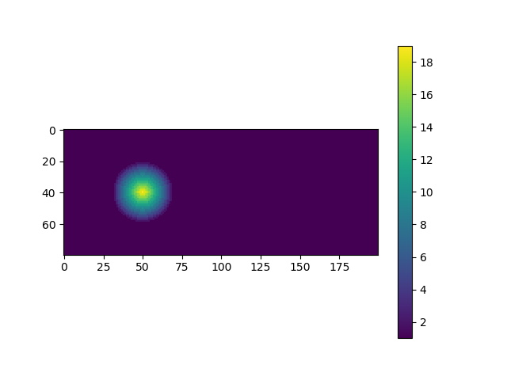
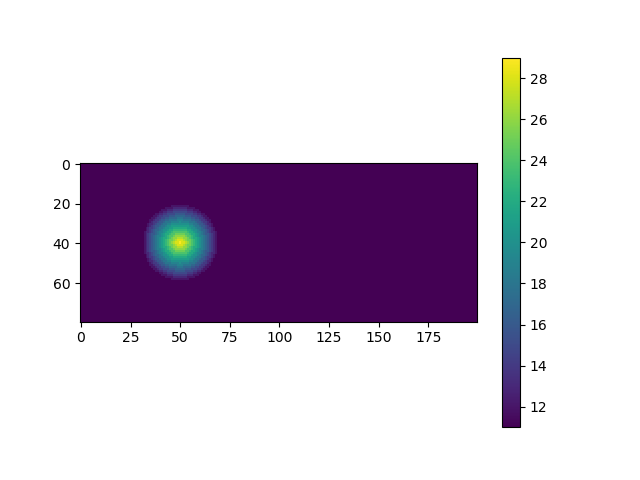
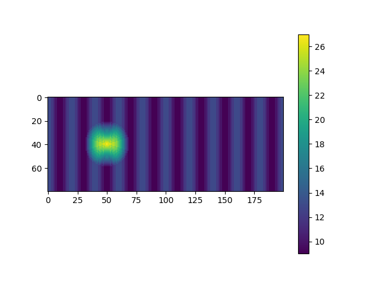
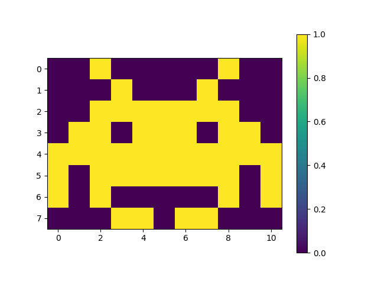
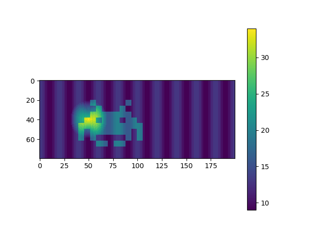
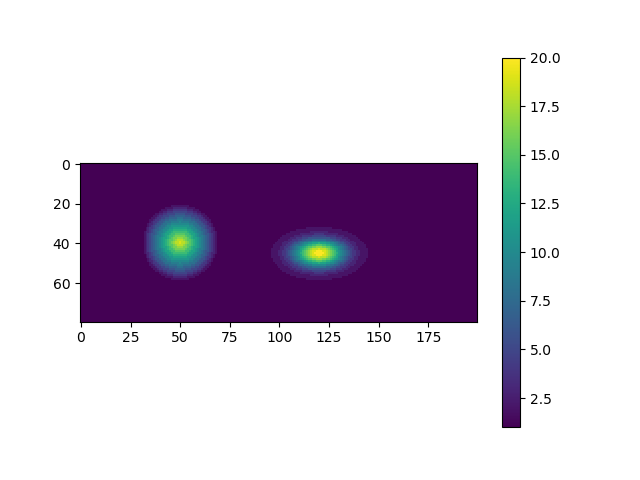

# Modify the Cellspace with python

Modify the .csp files that ReSCAL uses

Author: Gian-Carlo DeFazio, defaziogiancarlo@gmail.com

## Make a Rescal-snow cellspace into to python object

Rescal-snow already has utilities for the creation and modification of its cell space files,
which usually have a file suffix of `.csp` or `.csp.gz`.
The `CellSpace` class, in [scripts/utilities/cellspace.py](../scripts/utilities/cellspace.py) creates 
a python object using a `.csp` file. Having a python version of the cell spaces makes makes it easier to 
work with cellspaces when running Rescal-snow in python as demostrated here [rescal-in-python.md](./rescal-in-python.md).
The `heightmap` module is also used and can be found here [scripts/utilities/heightmap.py](../scripts/utilities/heightmap.py)

The `CellSpace` class cannot make a cell space, it needs to either read in a cell space from a `.csp` or `.csp.gz`
file, or it can be given a python bytearray. 

First, let's make a `.csp` file using `genesis`.
We'll use one of the example parameter files `snow_cone.par`.

```bash
cd build
./genesis -f ../scripts/snow_cone.par > /dev/null
```

`snow_cone.par` will instruct `genesis` to write the new cell space to `DUN.csp`.
You should see this file in the build directory.

```bash
ls
>> CMakeCache.txt  DUN.csp   bin2png              csp2bin  cspinfo  lib        rescal
>> CMakeFiles      Makefile  cmake_install.cmake  csp2png  genesis  regenesis
```

Move this file to `scripts/utilities` and go to that directory
```bash
mv DUN.csp ../scripts/utilities
cd ../scripts/utilities
```

Before we load in the `DUN.csp`, let's look at `snow_cone.par`.
```bash
head -n 15 ../snow_cone.par
>> ## PARAMETER FILE
>> #
>> # Creates a cone of snow, which will evolve into a barchan during rescal-snow simulation
>> #
>> # - KK
>>
>>
>> Model = SNO
>> Output_directory = ./out/
>>
>> Csp_file = DUN.csp
>> H = 50
>> L = 200
>> D = 80
>>
```
This shows that we should get a file named `DUN.csp` with height=50, length=200, and depth=80

Now start an interactive python session.

```bash
python3 -i cellspace.py
```

First we read in the `DUN.csp` file using the `CellSpace` constructor.

```python
>>> c = CellSpace('DUN.csp')
>>> c
<__main__.CellSpace object at 0x2aaaac964b00>
```

The CellSpace instance `c` now contains the contents of `DUN.csp`.
We can check the dimensions to see if they were read in correctly.
```python
>>> c.height
50
>>> c.length
200
>>> c.depth 
80
```

Or we can look at `c.cells`, which is a `numpy.ndarray`
```python
>>> c.cells.shape
(80, 50, 200)
```

When a CellSpace is instantiated, a height map of the terrain is created. If you are set up for graphical output
you can view the height map.
```python
>>> c.draw_height_map()
```

A window should pop up with this image


Let's increase the height of the entire surface by 10.
```python
>>> c.add_height(10)
>>> c.draw_height_map()
```
A window should pop up with this image


This looks about the same as the last one, but notice the scale on the right
now ranges from 11 to 29, instead of 1 to 19.

Let's add a sine wave
```python
>>> c.add_sinusoid()
>>> c.draw_height_map()
```

A window should pop up with this image



You can make your own custom edits. The most flexible way is to use the 
`add_height_map` method. This method takes a height map and superimposes it onto the
sand or snow surface. In fact, `add_sinusoid` and `add_height` methods just make a sinusoidal
or flat height map and then add it using `add_height_map`.

There is an example height map `heightmap.invader_template`.

We can view it by creating a `HeightMap` object.
```python
>>> h = heightmap.HeightMap(heightmap.invader_template)
>>> h.draw()
```

A window should pop up with this image


The `cellspace` module uses the `heightmap` module to process
and draw the 2D height maps made from the 3D cell space.  

`heightmap.invader_template` is just a `numpy.ndarray`.
If you dont' need to make a `Heightmap` object you can view it using
```python
>>> heightmap.draw(heightmap.invader_template)
```

This heighmap is pretty small. We can scale it up
```python
>>> big_invader = heightmap.scale(heightmap.invader_template, 7, 6, 6)
>>> heightmap.draw(big_invader)
```

A window should pop up with this image 

Notice that the horizontal and vertical axes are scaled by a factor of 6 and
the color bar ranges from 0 to 7 instead of 0 to 1.

To add the height map to `c.cells`

```python
>>> c.add_height_map(big_invader, top_left_corner=(20,40))
>>> c.draw_height_map()
```

A window should pop up with this image


We now have 3 modifications to the original cell space.
To undo these modifications
```python
>>> c.restore_original_cells()
>>> c.draw_height_map()
```

What if we want to save the changes we've made?
Let's make a change and save it.
We'll add a gaussian hill to compare with the cone.
```python
>>> gaussian_hill = heightmap.gaussian_hill(19, (5,9), 20, 30)
>>> heightmap.draw(gaussian_hill)
```

Now lets add this to `c`.
```python
>>> c.add_height_map(gaussian_hill, top_left_corner=(25, 90))
>>> c.draw_height_map()
```
A window should pop up with this image 

You can now write this modification to a file. To do so, just use the `write` method.
```python
>>> c.write(filename='snow_cone_gaussian.csp')
```

In fact you can write a compressed version.
```python
>>> c.write(filename='snow_cone_gaussian.csp', compressed=True)
```

Let's look at the files we just made.
```python
>>> quit()
```
```bash
ls -lh *.csp*
-rw------- 1 <user> <group> 6.2M <time> DUN.csp
-rw------- 1 <user> <group> 6.2M <time> snow_cone_gaussian.csp
-rw------- 1 <user> <group>  12K <time> snow_cone_gaussian.csp.gz
```

Notice that `DUN.csp` and `snow_cone_gaussian.csp` files are the same size.
This is expected because we only changed cell values, we didn't change 
the number of cells or any values in the file header. Also the compressed version
has a `.gz` added automatically.

If you were to do a `write` without specifying a `filename`,
the input file would be used, so in this case `DUN.csp` would be overwritten.
However, if you were to use `write` with `compressed` specified, a new file
called `DUN.csp.gz` would be written and `Dun.csp` would not be overwritten.

