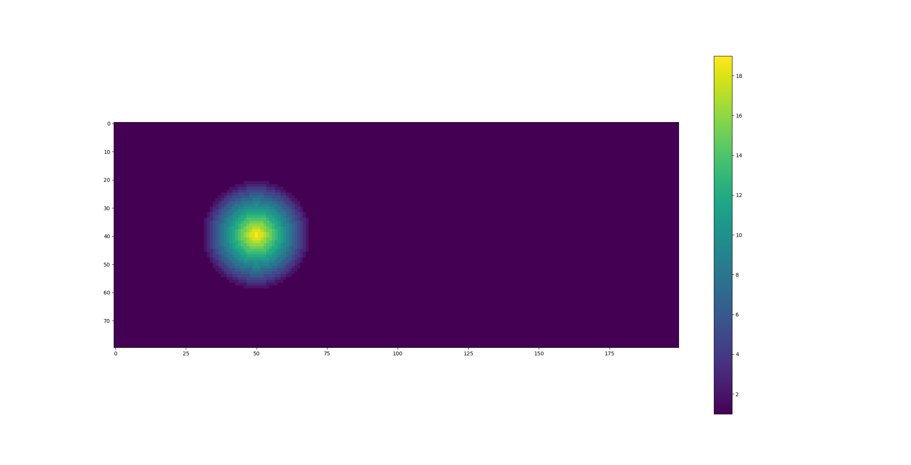
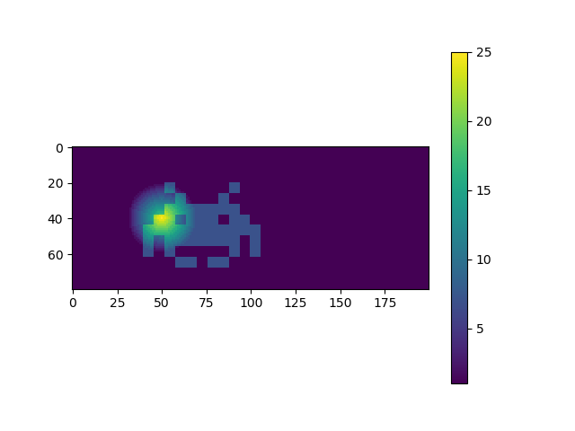

# Modify the Cellspace with python

Modify the .csp files that ReSCAL uses

Author: Gian-Carlo DeFazio, defaziogiancarlo@gmail.com

## Make a Rescal-snow cellspace into to python object

ReSCAL has utilities for the creation and modification of its cellspace files,
which usually have a file suffix of `.csp` or `.csp.gz`.
The CellSpace class, in [scripts/utilities/cellspace.py](#../scripts/utilities/cellspace.py) creates 
a python object using a .csp file. Having a python version of the cell spaces makes makes it easier to 
work with cellspaces when running ReSCAL in python as demostrated here [rescal-in-python.md].

The CellSpace class cannot make a cell space, it needs to either read in a cell space from a `.csp` or `.csp.gz`
file, or it can be given a python bytearray. 

First, lets make a .csp file using genesis.
We'll use one of the example parameter files `snow_cone.par`.

```bash
cd build
./genesis -f ../scripts/snow_cone.par > /dev/null
```

By default genesis will name the new file `Dun.csp`.
You should see this file in the build directory.

```bash
ls
>> CMakeCache.txt  DUN.csp   bin2png              csp2bin  cspinfo  lib        rescal
>> CMakeFiles      Makefile  cmake_install.cmake  csp2png  genesis  regenesis
```

Move this file to scripts/utilities and go to that directory
```bash
mv DUN.csp ../scripts/utilities
cd ../scripts/utilities
```

Before we load in the `DUN.csp`, let's look at the dimensions specified by `snow_cone.par`.
```bash
head -n 15 ../snow_cone.par
>> ## PARAMETER FILE
>> #
>> # Creates a cone of snow, which will evolve into a barchan during rescal-snow simulation
>> #
>> # - KK
>>
>>
>> Model = SNO
>> Output_directory = ./out/
>>
>> Csp_file = DUN.csp
>> H = 50
>> L = 200
>> D = 80
>>
```

This shows that we should get a .csp file with height=50, length=200, and depth=80

Now start an interactive python session.

```bash
python3 -i cellspace.py
```

First we read in the `DUN.csp` file using the `CellSpace` constructor.

```python
>>> c = CellSpace('DUN.csp')
>>> c
<__main__.CellSpace object at 0x2aaaac964b00>
```

The CellSpace instance `c` now contains the contents of the .csp file.
We can check the dimensions to see if they were read in correctly.
```python
>>> c.height
50
>>> c.length
200
>>> c.depth 
80
```

Or we can look at `c.cells`, which is a `numpy.ndarray`
```python
>>> c.cells.shape
(80, 50, 200)
```

When a CellSpace is instantiated, a height map of the terrain is created. If you are set up for graphical output
you can view the height map.
```python
>>> c.draw_height_map()
```

A window should pop up with this image


You can also look at the surface map, which looks a lot like a negative of the height map.
Surface maps are used internally for making height maps and editing the cells.

```python
>>> c.draw_surface_map()
```

A window should pop up with this image


We can now edit the cells. There are several ways to edit, but the most flexible way is to use the 
`add_height_map` method.

There is an example height map `heightmap.invaders`.
To add the heght map to `c.cells`

```python
>>> c.add_height_map((20, 40), heightmap.invaders)
>>> c.draw_height_map()
```

A window should pop up with this image


Notice that you can still see the cone under the space invader. This is because the heightmap is
placed on top of the surface of the sand.

You can now write this modification to a file. To do so, just use the `write` method.
```python
c.write(filename='invaded.csp')
```

In fact you can write a compressed version.
```python
c.write(filename='invaded.csp', compressed=True)
```

Let's look at the files we just made.
```python
>>> import os
>>> os.system('ls -lh *.csp*')
-rw------- 1 <user> <group> 6.2M <time> DUN.csp
-rw------- 1 <user> <group> 6.2M <time> invaded.csp
-rw------- 1 <user> <group>  12K <time> invaded.csp.gz
0
```

Notice that `DUN.csp` and `invaded.csp` files are the same size.
This is expected because we only changed cell values, we didn't change 
the number of cells or any values in the file header.