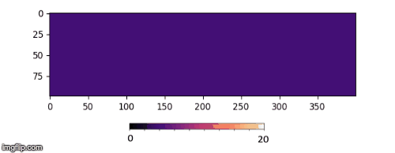
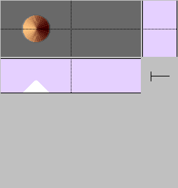
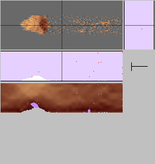
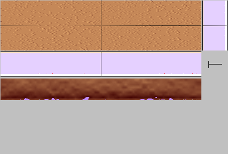
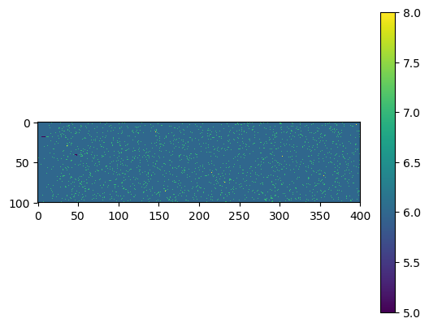
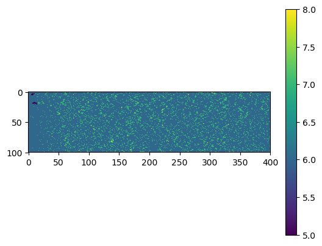
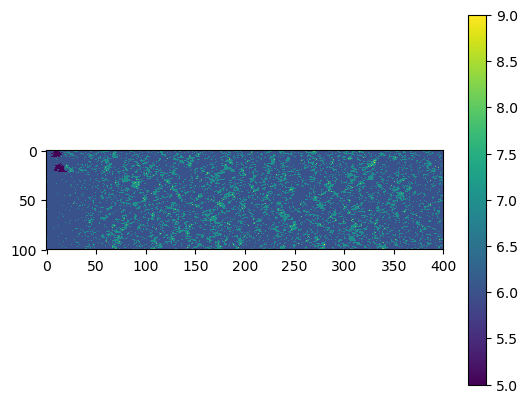

# Rescal-snow tutorial<a name="introduction"></a>



1. [Tutorial aims and features](#introduction)
2. [Getting started](#starting)
    1. [Prerequisites](#Prerequisites)
    2. [Example 1: a snow cone](#test-cone)
2. [Controlling the simulations](#modifying)
    1. [Example 2: sintering snow](#test-sinter)
    2. [Example 3: dune growth by snowfall](#test-snowfall)
3. [Visualizing the output](#visualizing)
4. [Setting up parallel runs](#parallel)
    1. [Example 4: parameter space exploration](#test-parallel)

## 1. Tutorial aim and features <a name="introduction"></a>

This tutorial walks through a series of examples that demonstrate how to use Rescal-snow to simulate:

 - Snow/sand grain erosion and deposition by wind
 - Snow dune formation
 - Snowfall
 - Visualization of simulation output
 - Time-dependent cohesion (snow sintering)
 - Parallel runs for phase space exploration

## 2. Getting started <a name="starting"></a>

Before starting this tutorial, download and install Rescal-snow according to the instructions in `README.md`.

We build complexity gradually through the tutorial, and recommend you work through it linearly.

### Prerequisites

We assume you have some familiarity with bash and terminal commands.
If you have never used bash, we recommend you stop and work through a short tutorial.
(Our favorite is ['The Unix Shell' from Software Carpentry](http://swcarpentry.github.io/shell-novice/).)

Rescal-snow is designed to be run through a terminal, although we are working on a python workflow ([docs/rescal-in-python.md](rescal-in-python.md). 
Many of our setup and analysis tools (used in Example 5) are written in Python.
To modify the simulation source code, you will need to work in C.

Example 4 discusses parallel runs. This will require use of parallel computing resources, and may require support from someone familiar with your computing cluster (or supercomputer, AWS allocation, etc).

**All blocks of bash instructions will start from the main rescal-snow directory:**

```bash
ls
>> AUTHORS.md   	lib	        scripts		build
>> LICENSE.md   	docs		paper.md
>> README.md	  	analysis    	src
```
(You may see additional files)

> To keep the directory references simple, we recommend you define:

> ```bash
> export RESCAL_SNOW_ROOT='<path to your Rescal-snow install>'
> ```
> where <path...> is the result of typing `pwd` in the directory above.
> If you hit directory or file not found errors, return to the home directory with `cd $RESCAL_SNOW_ROOT`.


### Example 1: a snow cone <a name="test-cone"><a>

**Running the example**

The first test run simulates a conical dune shaped by a strong wind. To run the example:
```bash
cd scripts
./snow_cone.run
```
This command will take a few minutes to run, and produces terminal output like:
```bash
>> PAR_FILE=snow_cone.par
>> OMP_NUM_THREADS=1
```
> *Nothing happening?*
> This is a good sign - if something is wrong, Rescal-snow almost always crashes in the first few seconds. This simulation may take several minutes to run, depending on the speed of your machine.
>
> *Still nothing happening?*
> In a separate terminal, look at the scripts directory (`ls scripts`). If the simulation has initiated successfully, you should see one or more files named `SNO0000X_t0.csp`, `genesis.log` and `rescal.log`. If you see these, the simulation is likely proceeding - slowly. You can stop the simulation whenever you see enough output for your purposes.
> We've put some tips for improving performance in [docs/performance_and_parallelization.md](performance_and_parallelization.md).

**Example 1 results**

The easiest way to examine the output is to look at rescal-snow's natively generated png files:

```bash
eog scripts/*.png
```
If `eog` is not available, use `open` (MacOS) or any image viewer.

These files are numbered sequentially, and output at intervals set by the `-dpng` flag in [scripts/snow_cone.run](../scripts/snow_cone.run). For this run, we used `-dpng 10t0`, so file 0 is saved at simulation time t0=0, file 1 (SNO00001\_t0.png) is saved at
simulation time t0=10, and so on.

|Initial condition, SNO00000_t0.png 	|  SNO00003_t0.png   | SNO00009_t0.png  |
|------------------------|--------------------|------------------|
|  |  |  |

Each of the three images above shows a shaded top-down view of a dune (top left), cross-sections through the dune, along the dashed lines (middle left, top right), and a cross-section showing the pressure intensity in the fluid (bottom left).

**Interpretation**

The initial condition (t0=0) is a small cone of sand. As the simulation runs, the cone quickly self-organizes into an elongate dune, and moves downwind.
As time progresses, the dune gradually loses grains. These are not replaced, and the dune dwindles away: this dune is not stable in these (high-wind, no resupply) conditions.

## 2. Controlling the simulation <a name="modifying"></a>

In the next two examples, we walk through the .run and .par scripts that control the behavior of the simulation, and present example simulations that show you how to modify two important snow parameters: sintering and snowfall.

### Example 2: sintering snow <a name="test-sinter"></a>

The [first example dune](#test-cone) we discussed disappeared quickly as grains blew away in the wind.
Real snow, however, hardens over time. This allows real dunes to persist for days, or even months.
We mimic this process in rescal-snow by adding sintered grains, which erode less easily than regular grains.

You can run an example snow feature with sintering with:
```bash
cd scripts
./sintering.run
```

As we are running all the tutorials in the same `scripts` directory, it's important to delete old output to avoid mixing the output from two runs. The `sintering.run` command should prompt you to do this:
```bash
Deleting files of types *.(png|bin|csp|log|gz|data|vel|car) in current directory [n|y] and out directory ?
y
```
Or you can do it manually with `./clean`.

**Example 2 results**

This produces the following series of png images, with sintered grains shown in light purple and non-sintered grains shown in tan:


This image shows a triangular wave of snow. It quickly leans over to the right. Like the first dune, it begins to blow away in the wind. Some grains at the bottom of the dune, however, sinter (turning light purple in the top left panel of the image). These grains persist for
much longer than the non-sintered grains, but eventually they too blow away.

*Why is this run different from the first one?*

The only change between `snowfall.run` and the previous script, `snow_cone.run` (excepting a few changes to the comments) is the parameter file:
```bash
diff scripts/sintering.run scripts/snow_cone.run
>> < PAR_FILE="sintering.par"
>> > PAR_FILE="snow_cone.par"
```

If we look at the differences between parameter files, we see:
```bash
diff scripts/sintering.par scripts/snow_cone.par
>> < Csp_template = WAVE(15)
>> > Csp_template = CONE(20,40,50)
>> < Lambda_S = 0.01
>> > Lambda_S = 0.00
>> < Lambda_F = 0.05
>> > Lambda_F = 0
```
**Interpretation**

 - Csp\_templeate selects one of several initial conditions defined in [src/genesis.c](src/genesis.c): the initial condition is now a 15 cell high triangular wave instead of a 20 cell high cone
 - Lambda\_S controls the rate of sintering: we increased it from 0 to 0.01/t0.
 - Lambda\_F controls the relative erodibility of the sintered grains: we set it to 0.05/t0, or 5% of the erodibility of the non-sintered grains

> All rescal-snow parameters are all given brief descriptions in the .par file, and in [docs/rescal-snow-inputs.md](rescal-snow-inputs.md).

### Example 3: dune growth by snowfall <a name="test-snowfall"></a>

Sintering increases the lifespan of snow features, but they still blow away eventually. In reality, snow features don't just disappear - they also appear, and grow. This can occur when the dunes gain mass, for example from snowfall.

We have set up a snowfall simulation in the scripts directory that you can run with:
```bash
cd scripts
./snowfall.run
>> Deleting files of types *.(png|bin|csp|log|gz|data|vel|car) in current directory [n|y] and out directory ? 
y
```
Again, this run script calls a new parameter file:
```bash
diff scripts/snowfall.run snow_cone.run
>> > PAR_FILE="snowfall.par"
>> < PAR_FILE="snow_cone.par"
```

The parameter file for this run has numerous differences from the ones before. The critical ones are:
```bash
diff snowfall.run snow_cone.run
>> > Csp_template = SNOWFALL(4)
>> < Csp_template = CONE(20,40,50)
>> > Lambda_I = 0.001
>> < Lambda_I = 0
```

 - The SNOWFALL template sets an initial condition to be a flat layer of cells of thickness 4, and creates a layer of injection cells to generate snowfall on the simulation ceiling.
 - Lambda\_I controls the rate of snow injection; its behavior depends on the type and location of the injection cells, and thus on the template.

**Example 3 results**

The snowfall example, above, produces png files among its outputs. Unfortunately, the default rescal-snow rendering does not capture the behavior of these dunes as well as it captured the cone; the falling snow obscures the surface (left-most picture in image below; airborne
grains are red).

To see the output clearly, we will make custom images with matplotlib (Python). We will make topographic maps showing the dunes' elevation. This data is output in scripts/out/ALTIxxxxx.log files; their output frequency is controlled by the `-dcsp` flag in the run script.

## 4. Visualizing the simulation output <a name="visualizing"></a>

The following python commands may be run (interactively, or as a script) to recolor three example output frames from the snowfall simulation:

```python
$ cd scripts
$ python3
import sys
sys.path.append('utilities')    # Add utilities to Python path
import os
import matplotlib.pyplot as plt # Plotting
import heightmap                # utilities/heightmap.py contains tools for reading and visualizing height maps (ALTI files)

# Find the heightmap files to visualize. In this tutorial, they are named out/ALTIxxxxx.log.
filenames = ['out/'+f for f in os.listdir('out') if f[:4]=='ALTI']
filenames = [f for f in filenames if f[-4:]=='.log']
filenames.sort()
print(filenames)
>> ['ALTI00000_t0.log', 'ALTI00001_t0.log', 'ALTI00002_t0.log', 'ALTI00003_t0.log', 'ALTI00004_t0.log', 'ALTI00005_t0.log', 'ALTI00006_t0.log', 'ALTI00007_t0.log', 'ALTI00008_t0.log', 'ALTI00009_t0.log', 'ALTI00010_t0.log', 'ALTI00011_t0.log', 'ALTI00012_t0.log', 'ALTI00013_t0.log', 'ALTI00014_t0.log', 'ALTI00015_t0.log', 'ALTI00016_t0.log', 'ALTI00017_t0.log', 'ALTI00018_t0.log', 'ALTI00019_t0.log', 'ALTI00020_t0.log', 'ALTI00021_t0.log', 'ALTI00022_t0.log', 'ALTI00023_t0.log', 'ALTI00024_t0.log', 'ALTI00025_t0.log', 'ALTI00026_t0.log', 'ALTI00027_t0.log', 'ALTI00028_t0.log', 'ALTI00029_t0.log', 'ALTI00030_t0.log']

# Visualize the files. This may take a few seconds.
for name in filenames:
    # Read the file as a HeightMap object
    hm  = heightmap.HeightMap(name)
    # hm.draw                   # Uncomment to view each image as it is produced
    hm.save_color_map(name[:-4] + '_image.png')
    
 exit()
 $ eog out/*image.png           # View images 
```
This produces images like the following:

| Default image, SNO00050_t0.png | ALTI00005_t0_image.png | ALTI00015_t0_image.png | ALTI00025_t0_image.png |
|-----------|----------------|------------|---------------|
|  |  |  |  |

The full evolution of this simulation, running for a longer time, is shown in the gif at the top of [README.md](../README.md).

> Additional scripts for analysing and visualizing the runs are available in the scripts/utilities and analysis directories.

## 5. Setting up parallel runs <a name="parallel"></a>

We believe that building robust, trustworthy models is much simpler when it's easy to make many model runs. This enables:
 - Parameter space exploration
 - Sensitivity analyses
 - Uncertainty quantification
and a general ability to run the model often enough to trust that our results are robust, reproducible, and difficult to skew by cherry-picking.

We have therefore added utilities to help you set up batches of many runs of rescal-snow.

### Example 4: parameter space exploration <a name="test-parallel"></a>

This example requires access to parallel computing resources, such as a university computing cluster. 

> If you do not have access to a computing cluster, the Community Surface Dynamics Modelling System (CSDMS) organization provides free high-performance computing resources for Earth surfaces research.
> See [csdms.colorado.edu/wiki/HPC](https://csdms.colorado.edu/wiki/HPC) for details.

> We assume this could also be done with a 10-processor allocation on a cloud computing platform, such as Google Cloud or AWS, though we have not tested this option.
> Students, educators and researchers may be eligible for free computing resources from major cloud computing providers - look around for current information.


In this example, we're going to run 10 instances of rescal. Begin by downloading and installing rescal-snow on your computing cluster, and running one of the above examples to test the installation.

> *Why are we running 10 instances of rescal-snow, not one instance on 10 cores?*
> Rescal-snow doesn't parallelize well: see [docs/performance_and_parallelization.md](performance_and_parallelization.md)

*Writing large numbers of input files*
[scripts/utilities/rescal_utilities.py](../scripts/utilities/rescal_utilities.py) contains tools for writing .run and .par scripts automatically. This is much easier, and more bug-free, than writing 10 parameter files by hand.

To set up the runs:

```bash
cd scripts/utilities
python param_space_exploration_example.py
cd ../..
```

You should see that this script has created a new directory called test_parallel_runs, containing ten subdirectories:
```bash
ls test_parallel_runs
>> tauMin0_lambdaI0.001  tauMin1000_lambdaI0.001  tauMin100_lambdaI0.001  tauMin200_lambdaI0.001  tauMin300_lambdaI0.001
>> tauMin0_lambdaI0.01   tauMin1000_lambdaI0.01   tauMin100_lambdaI0.01   tauMin200_lambdaI0.01   tauMin300_lambdaI0.01
```
Each subdirectory contains the executables and input needed for a rescal-snow run:
```bash
ls test_parallel_runs/tauMin0_lambdaI0.001
>> genesis  real_data  rescal  run.par  run.run
```
Running `./run.run` in this test_parallel_runs/tauMin0_lambdaI0.001 directory would begin a rescal-snow run (you may wish to test this now; if you encounter permissions errors, run `chmod u+x *` in the same directory).

The directory names list the run parameters. For example, test_paralle_runs/tauMin0\_lambdaI0.001 uses a snowfall rate of 0.001/t0, and has the highest possible wind strength (tauMin=0).
The other nine subdirectories contain material for runs with different snowfall rates and wind strengths.

We can submit all of these runs simultaneously using scripts/run_parallel_rescal.msub (for Moab systems).
These scripts contain `#MSUB` commands describing the user's email, the queue, the resources in terms of nodes or processors, etc, e.g.:
```bash
#MSUB -q pbatch
#MSUB -M yourname@yourserver.com
#MSUB -l nodes=1
#MSUB -l walltime=00:05:00
```
You will need to modify these commands to match an allowable job structure and allocation on your computing cluster.
If this process is not familiar, look for an "example job script" released by your computing facility, or contact someone familiar with that facility.

Once you have a working msub/sbatch script, run:
```bash
cd scripts
msub test_parallel_runs.msub
```
on a Moab system, or `cd scripts; sbatch test_parallel_runs.sbatch` on slurm.

Each subdirectory should now produce its own 'out' directory accompanied by log files, png output, and cellspace (.csp) files. After four output intervals pass, it looks like this:

```bash
ls test_parallel_runs/tauMin0_lambdaI0.01
>> DUN.csp             SNO00001_t0.csp.gz    SNO00003_t0.csp.gz  genesis    rescal-ui.xml
>> GENESIS.log	       SNO00001_t0.png	     SNO00003_t0.png     out        run.par
>> SNO00000_t0.csp.gz  SNO00002_t0.csp.gz    SNO00004_t0.csp.gz  real_data  run.run
>> SNO00000_t0.png     SNO00002_t0.png       SNO00004_t0.png     rescal

ls test_parallel_runs/tauMin0_lambdaI0.01/out
>> ALTI00000_t0.log  CELL.log                 LGCA.log      TRANSITIONS.log
>> ALTI00001_t0.log  CELLSPACE_SIGNATURE.log  MVT_IO.log    VEL.log
>> ALTI00002_t0.log  CGV_COEF.log             PROB_CGV.log
>> ALTI00003_t0.log  DENSITE.log              SIGN_HPP.log
>> ALTI00004_t0.log  DOUBLETS.log             TIME.log
```

> *Troubleshooting for parallel runs*
>
> - msub/sbatch commands not allowed by your computing cluster 
>    -  use an example run script for your cluster as a template, if available
>    -  seek support from someone familiar with the cluster
> - permissions errors 
>    - run `chmod u+rwx \*` in test_parallel_runs
>    - contact administrator if this is disallowed
> - script could not find input (run.run or run.par or sealevel_snow.prop) 
>    - rerun param_space_exploration_example.py and confirm that it produced the output above
>    - check that you're running msub/sbatch from scripts directory
>    - check relative directory references in msub/sbatch script and submit.sh
> - runs time out before producing useful output 
>   - increase walltime
>   - reduce simulation domain size (parameters 'L' and 'D' in `.par` file)
>   - large simulations may run for many hours


**Example 4 results**

The following phase diagram shows the 100th images produced by each of these runs (t0 = 1000; snowfall rate = lambda\_I; wind strength = Tau\_min). 


The runs with the higher snowfall rate have a much deeper average snow depth than the runs with lower snowfall rate.
The runs with high wind speed (low Tau\_min) have less even snow cover, with better-defined ripples and dunes.

### Run ReSCAL within python <a name="python"></a>

There is an option to run ReSCAL in such a way that the `.csp` files are piped to a python process that processes them while ReSCAL is running. This can be useful for reducing the amount of disc space used and may have a siginific\
ant speed increase for some configurations. There is an example of how to do this at [docs/rescal-in-python.md](rescal-in-python.md). 
For more information on processing the `.csp` files within python, see [docs/modify-cellspace.md](modify-cellspace.md).
