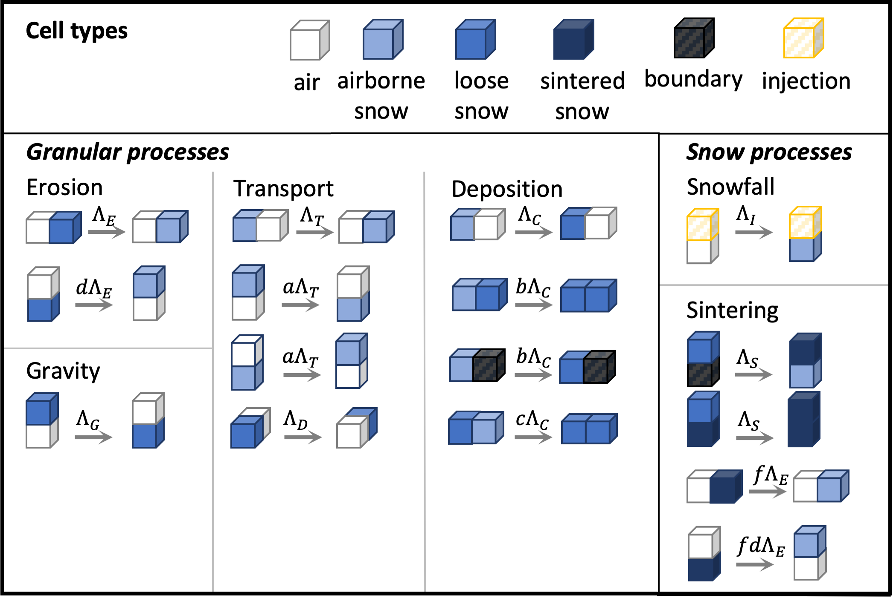

# Summary

When wind blows over dry snow, it creates shapes known as snow bedforms.
These features, which include snow dunes, waves, snow-steps and sastrugi (Fig. 1), ornament Antarctica, Arctic sea ice, tundra, and mountain ridges [@Filhol2015; @Kochanski2018; @Kobayashi1980].
They change the reflectivity and average thermal conductivity of snow, and may change the patterns of snow accumulation and transport.
Despite these effects, however, snow bedforms are poorly understood and not yet included in major snow or climate models.

_Figure 1. Snow bedforms on Niwot Ridge, Colorado. From left to right, small dunes and sastrugi (looking upwind), snow dunes (looking downwind), snow-waves (looking upwind)._

## Requirements of a snow bedform model
Recent field studies have identified three new computational components needed for a good understanding of snow bedforms [@Kochanski2018; @Kochanski2019; @Filhol2015].

First, most snow bedforms (e.g. ripples, barchan dunes, snow-steps and sastrugi) are between 0.1 and 2 m in length, with select bedforms (e.g. snow-waves, some whaleback dunes) extending from 5 to 30 m.
These length scales are based on physical phenomena such as the hop length of blowing snow grains [@Kobayashi1980] and the length scales of turbulent structures in the wind [@Kobayashi1980; @Kochanski2019].
Existing models of wind-blown snow, however, are designed to model snow redistribution over mountainous [@Liston2007; @Lehning2002; @Marsh2018] or continental [@Gallee2012] scales,
(with grid sizes of 0.1-10 km)
and are unable to resolve the processes that lead to the formation of snow bedforms.

Second, snow bedforms are shaped by both sand-like granular motion and cohesive forces between snow grains [@Kochanski2019; @Filhol2015].
Granular motion, including avalanches and wind-driven saltation, is successfully represented by existing sand dune models (e.g. @Narteau2014, @Lammel2012].
These models, however, do not include the cohesive forces that occur in snow.
Similarly, the simulations that have advanced our understanding of cohesion and sintering in snow (e.g. @Colbeck1983, @Lehning2002a) have focused on immobile snow, and do not include granular transport.

Third, snow bedforms usually form during and immediately after snowfall events [@Kochanski2018], which are also not included in existing models of sand-like granular motion.

Computational studies of snow bedforms therefore require a model that represnts granular transport and snow processes, including cohesion and snowfall, at <0.1 m resolution.

## Features of Rescal-snow
Rescal-snow is designed to enable the quantitative study of snow bedforms.
It simulates 10-100 m domains at 0.05-0.20 m resolution, allowing it to capture all but the smallest snow bedforms.
The simulation is adapted from a sand dune model, ReSCAL [@Narteau2014], and inherits ReSCAL's granular transport capability.
We have added features to simulate snow processes, including snowfall and time-dependent cohesion.
Fluid processes are modeled with a lattice gas cellular automaton, a method chosen to provide a good approximation to the Navier-Stokes equation at reasonable computational cost.
Finally, the backbone of the simulation is a cellular automaton, an algorithm known to be particularly good for modeling self-organization.
This cellular automaton contains a grid of cells of discrete types (Fig. 2, top), which evolve in nearest-neighbor pairs (Fig. 2, bottom). Each doublet transition occurs stochastically, as a poisson process with the average rates specified along the arrows in Fig. 2. 
The transitions represent the local interactions between grains that, en masse, imitate aeolian grain transport [@Narteau2014], and snow processes like metamorphosis.
The transition rates represent the time scales of transport and metamorphism and are input parameters to the model.
The transition grain types and orientations are documented in `models.c`.

_Figure 2. Cellular automaton transitions in rescal-snow._

This simulation will allow snow scientists to translate local field studies into general models.
It will also make it easier to investigate the effects of snow bedforms on (1) surface roughness, (2) snow cover fractions, and (3) accumulation rates. This will allow us to describe the effects of meter-scale bedforms in terms of variables that affect large-scale energy balances.

### Example simulations
We have used Rescal-snow to simulate the formation and movement of snow dunes and snow-waves under a range of wind, snowfall, and sintering conditions.
We illustrate these results through the example simulations in our `README` file,
and in the [associated tutorial](../docs/rescal-snow-tutorial.md). These lead readers through a previously-unmodeled scientific question: how do bedforms affect the accumulation of snow?

### Limitations
The natural length and time scales of Rescal-snow are set by the configuration of the cellular automata.
Relating these scales to measured sizes and durations requires careful calibration, as described fully in @Narteau2009.
The length scale of Rescal-snow cells, for reasonable model configurations, is 0.05-0.15 m. This limits the model's ability to resolve centimeter-scale snow features, such as snow-steps [@Kochanski2019], and the corners of sharp-edged features, such as sastrugi.

Rescal-snow cells also have discrete states. For example, the simulated cohesion is binary: it represents 'loose' and 'sintered' snow grains, but does not represent intermediate states. Although it is possible to implement an arbitrarily large number of intermediate cell states in the cellular automaton, this incurs a significant performance cost. Thus, Rescal-snow only approximates the effects of snow metamorphosis and cannot represent those processes with the level of subtlety available in continuous models such as @Lehning2002a.

### Good practices in computational snow science
We aim to demonstrate good practices that will encourage robust, reproducible science by releasing Rescal-snow through Journal of Open Source Science.
Our work is aimed at geomorphologists and snow scientists, and we use this model frequently while working with students.
We expect that our work will be many users' first introduction to some subset of bash, git, C, Python or high-performance computing, and we aim to make this a positive learning experience.
Therefore, we designed our examples around scientific applications of all of these skills, and we punctuate them with references to relevant tutorials.

We also believe that good computational science is easier when users are able to make large numbers of model runs.
This allows users order to test the stability of the model, explore a wide range of physical parameters, and gain an accurate understanding of the model uncertainty.
We have set up structures for configuring, running, and analyzing parallel simulation instances to enable users to run high-quality numerical experiments with Rescal-snow.

# Acknowledgments

This work was performed under the auspices of the U.S. Department of Energy by Lawrence Livermore National Laboratory under Contract DE-AC52-07NA27344. This paper is released under LLNL-JRNL-786878.

We thank Clement Narteau and Oliver Rozier (IPGP) for advice and support in development beginning with ReSCAL 1.6,
Robert Anderson and Gregory Tucker (CU) for advice on the scientific direction of this software,
and Tapasya Patki, Divya Mohan, Jeff Booher-Kaeding and Aaron Robeson (LLNL) for minor contributions to Rescal-snow.

The project was supported by a Department of Energy Computational Science Graduate Fellowship (DE-FG02-97ER25308), by support from the Data Science Summer Institute at Lawrence Livermore National Laboratory, and by a UROP award from the University of Colorado.

# References
